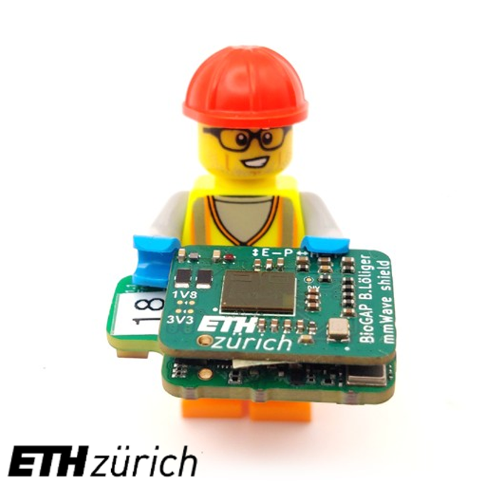
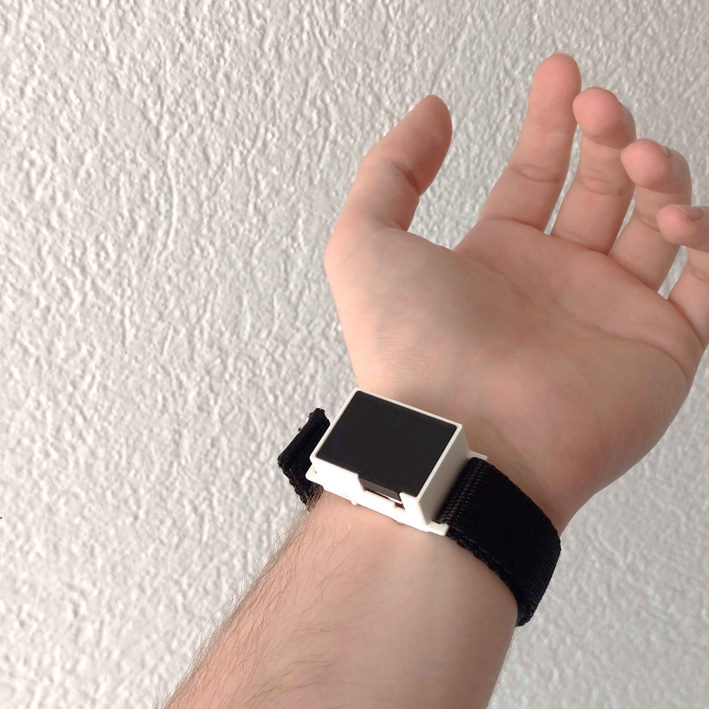
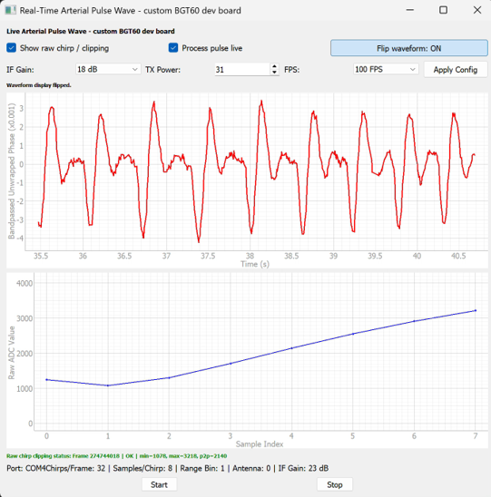

## TO-DO
-Clean up jpyter notebook

-How to docs?

-Add docs for fw changes made in detail

<p align="center">
  
</p>

# mmWave-shield

## Wearable mmWave Sensor, for BP measurments. Shield for the BioGap9 Platform 

## Introduction

This repository contains the hardware, firmware, and software developed for a wearable mmWave radar sensing prototype based on the BioGAP platform.

The project integrates a custom BGT60TR13C mmWave radar shield with the BioGAP firmware and provides Python tools for data acquisition, live visualization, offline signal processing, and validation measurements.

The system was developed as a research prototype for contactless pulse-wave sensing using a wearable mmWave radar sensor.

<p align="center">
  <br>
  <em>BioGAP mmWave radar system during validation measurements.</em>
</p>

The prototype includes the following main features:

- Custom mmWave radar shield based on the Infineon BGT60TR13C radar sensor
- Integration with the BioGAP wearable platform
- SPI-based radar control and raw frame readout
- BLE-based command interface and raw radar data streaming
- Python host software for acquisition, live viewing, and offline analysis
- Support for synchronized validation measurements with Finapres/NovaScope reference data
- Mechanical casing files for reproducing the validation setup


## Structure of the Repository

This repository is organized into the following main folders:

```text
Repository/
├── Documentation/
├── Firmware/
├── Hardware/
├── Software/
└── README.md
```

- `Documentation/` contains user documentation, setup instructions, and additional project notes and images.

- `Firmware/` contains the BioGAP firmware extension for the mmWave radar shield. This includes the mmWave application layer, radar control logic, BLE command integration, and firmware configuration changes.

- `Hardware/` contains the hardware design files for the custom mmWave radar shield and the mechanical casing files. This includes KiCad PCB files, fabrication outputs, casing STEP files, and Solid Edge source files.

- `Software/` contains the Python host software for acquisition, live visualization, signal processing, plotting, and validation analysis.

## Usage

For detailed setup and usage instructions, see [Getting started](Documentation/getting_started.md) (todo).

The documentation covers the hardware setup, firmware flashing, Python environment setup, acquisition scripts, live visualization, and offline processing workflow.

A typical workflow consists of flashing the mmWave firmware, starting the Python host software, recording raw radar data, and processing the measurements offline.

<p align="center">
  <br>
  <em>Python live viewer used to inspect the mmWave radar waveform in real time.</em>
</p>

## Authors

This project was developed at the Integrated Systems Laboratory (IIS) at ETH Zurich.

Main development:

- Benjamin Löliger, ETH Zurich  
  Hardware design, firmware integration, Python software, measurements, signal processing, documentation

Supervision and support:

- Sebastian Frey, ETH Zurich  
  Supervision and project guidance

- Andrea Cossettini, ETH Zurich  
  Supervision and project guidance

- Nima Bahmani, Aalton Finland  
  Supervision and project guidance


## License

The following parts of this repository are released under the Apache License 2.0:

- `Software/`
- `Firmware/`

See the corresponding license files for details: [Software/LICENSE](Software/LICENSE) and [Firmware/LICENSE](Firmware/LICENSE).

The hardware design files are released under the Solderpad Hardware License v0.51:

- `Hardware/`

See [Hardware/LICENSE](Hardware/LICENSE) for details.

This includes the PCB design files as well as the mechanical casing design files, such as STEP and Solid Edge files.

The following documentation images are released under the Creative Commons Attribution 4.0 International License (CC-BY-4.0):

- `Documentation/images/`
- `Hardware/casing/images/`

See the corresponding license files for details: [Documentation/images/LICENSE](Documentation/images/LICENSE) and [Hardware/Casing/images/LICENSE](Hardware/Casing/images/LICENSE).

Some files in the software tools directories contain third-party source code from the Infineon Radar SDK or files based on Infineon example code. Some of these files were adapted for this project.

See the respective source file headers for original copyright notices, modification notes, and license terms.

## Limitation of Liability

The hardware designs, firmware, and software in this repository are provided as-is, without warranty of any kind.

The project is a research prototype and is not intended for medical diagnosis, clinical decision-making, or safety-critical use. The authors and contributors are not liable for any damages or losses arising from the use of this repository, including but not limited to hardware damage, data loss, measurement errors, or incorrect interpretation of results.